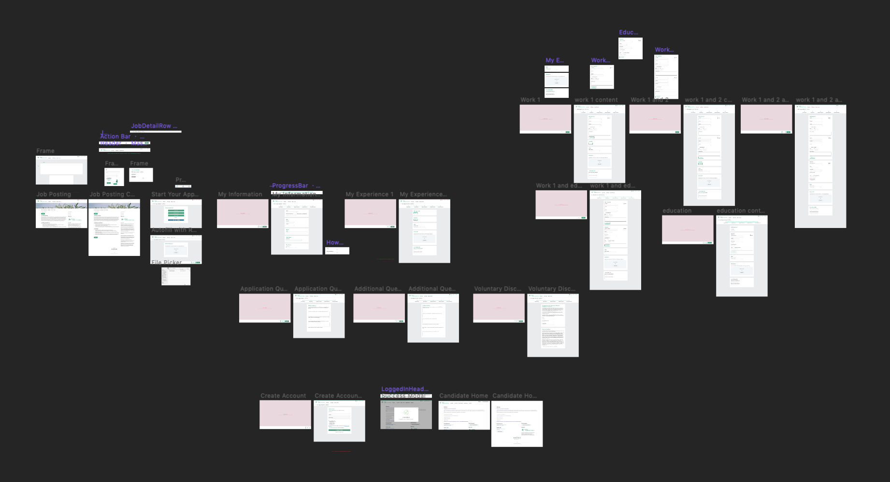

# Apply Flow Prototype

This is a prototype of our earliest designs for the job application redesign.

It sits between the existing flow of `old Job Details -> new Job Application -> old Candidate Home`.

Design changes:

- Progress bar updates
  - Shows all the steps
  - Sticky
- Updated button positions
- Updated visual design and header
- Panel sets for every chunk of the form
- Smarter fields
  - Searchable and creatable dropdowns using react-select
  - Auto-complete address searching using Google Maps
  - phone number field masking
- Account creation as the last step

The overall flow remains mostly the same due to technical and content limitations. The existing setup process for job applications is very complex and involves multiple product teams. There is no way to do a simple data migration to a new flow. And even if we could update the entire job application creation process, companies would all have to update their old job applications, which would likely take many years.

---

Prototype Flow

_All fields are optional even if they're marked as required_

- Apply > Apply Manually
- Click Next on all steps
  - On the My Experience page, you also need to add Education one time and add Work Experience two times before you can click Next
- Finish by landing on the confirmation page

Known prototype issues

- Sometimes you have to click twice for an action to fire
- Can't turn off drag scrolling
- lag due to Framer X's `Data` implementation triggering many rerenders
- adding panel sets (Work Experience, Education) makes you scroll back to the top of the page. There's no way to prevent this in Framer X

---

After creating this, Framer X made a LOT of breaking changes that I cannot for the life of me figure out how to fix.

I'm leaving the project files here for posterity, but watching a video of the prototype will be much more helpful than trying to run this...

- On Chrome, the bottom action bar disappears on larger screen sizes when scrolling
- react-select clicking no longer opens the menu. Right clicking seems to work though...
- Clicking on options in the address auto-complete does not work correctly either

---

To create a build that anyone can run, open Framer X, click the job details screen, and go to File > Export Web Preview.

If I had to do it again, I would not have chosen Framer X for this job. I don't think it's a good match for the workflow I was trying to create.
